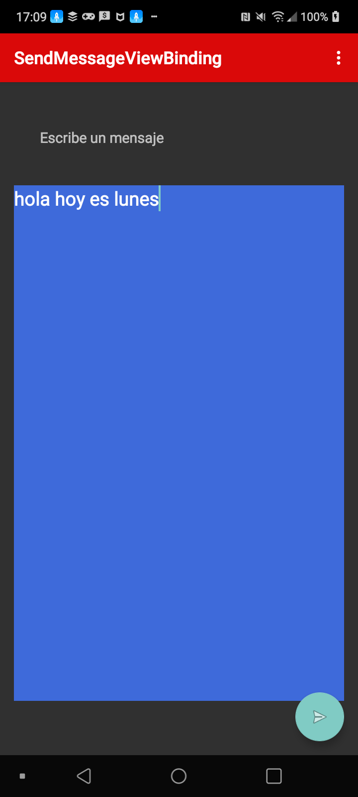
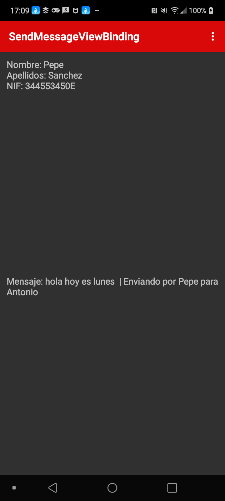
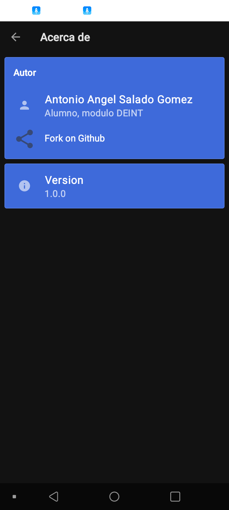
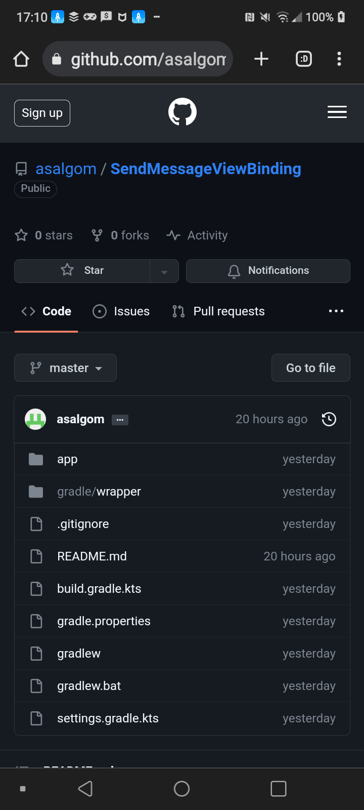

# SendMessageViewBinding

El objetivo de este ejercicio es crear una aplicacion con varios activity que consiste en escribir un mensaje y luego enviarlo a otra activity usando intents y bundle y viendo como funcionan los metodos callback y creando otra variente usando el ViewBinding

# Empezando a crear la aplicacion SendMessage

La aplicacion consistira de una activity SendMessage que tendra un TextView con un EditText que podremos escribir un mensaje, un boton para enviar el mensaje que hemos escrito antes a una activity que sera ViewActivity se mostrara la informacion del receptor del mensaje y abajo se mostrara el mensaje junto al receptor del mensaje

Se creara tambien dos clases Person y Message los usaremos para crear objetos de persona y de mensaje.

# Usando los intent y bundle

Ahora usaremos los intent que se utilizan para iniciar componentes, pasar datos entre componentes y realizar otras acciones en nuestra aplicacion. y bundle que es un contenedor de datos utilizado para pasar datos entre componentes de una aplicación, generalmente entre actividades o fragmentos, los usaremos para que las dos activity se puedan comunicar, en SendMessage se usara el intent para comunicarnos con ViewActivity y luego un bundle que sera el contendido de los objetos de persona y mensaje. En ViewActivity recogemos los datos del SendActivity con el metodo getIntent().getExtras() con el mensaje recogido del Bundle usamos las variables para mostrar el mensaje y los datos del usuario en el ViewActivity

# Usando el logcat y los metodos callback

Tambien vimos una herramienta que es bastante util que es el logcat que muestra información detallada sobre el funcionamiento de una aplicación Android mientras se está ejecutando en un dispositivo o emulador.
Con esta herramiento podemos ver errores que normalmente no podemos ver por ejemplo cuando queremos pulsar el boton para enviar el mensaje que hemos escrito en el SendMessageActivity y luego se nos cierra la aplicacion eso es porque ha ocurrido una excepcion eso lo podemos mirar en el logcat para saber que tipo de excepcion es y quien lo ha causado, asi podemos arreglar esos problemas. Tambien nos permite filtrar registros en función de etiquetas, niveles de prioridad y texto, lo que facilita la búsqueda de información específica en el registro.

En el concepto de ciclos de vida de un activity vimos los metodos callback que se utilizan para gestionar eventos o interacciones en una aplicación, con estos metodos nos permiten controlar y responder a eventos en la aplicación sin necesidad de activar manualmente funciones en respuesta a estas interacciones, hemos usado estos metodos en nuestra aplicacion y se pueden ver en el logcat en que estado estan se llaman estos metodos mediante Log.d(TAG, OnPause) por ejemplo cuando estamos en el ViewActivity cuando vemos el mensaje que hemos en SendMessageActivity si le damos a back, se ejecutara el metodo OnDestroy haciendo que la activity ViewActivity se destruya por completo haciendo que se libere cualquier recurso que ya no sea necesario.

# Viendo la depuracion paso a paso

Vimos tambien como usar Debub Brigde que es una herramienta muy util para ver la ejecucion de nuestra aplicacion paso a paso podemos ver tambien las expresiones que tendra en toda la ejecucion de la aplicacion. Tambien sirve para ver si tenemos errores en el codigo para saber que punto exacto de la ejecucion del codigo ha dado ese error, usaremos puntos de interrupcion para hacer que el la ejecucion de la aplicacion se pare y luego ver la ejecucion paso a paso.

# Creando variante SendMessageViewBinding

Despues decidimos crear una copia de la aplicacion SendMessage como otro variante que le llamamos SendMessageViewBinding, aqui dejaremos de usar el metodo findViewById en lugar de eso usaremos el ViewBinding que nos permite vincular de manera más eficiente las vistas en el archivo de diseño XML con el código Java o Kotlin que controla la lógica de la interfaz de usuario. Por eso dejariamos de usar findViewById para obtener referencias a las vistas, lo que puede ser propenso a errores y poco eficiente en términos de rendimiento. Tambien vimos como poner una fuente de texto nuevo a la aplicacion y de poner otra activity diferente para cuando la aplicacion este en horizontal

# Creando el About Us

Para terminar hariamos un activity AboutUs que consite en mostrar el autor de la aplicacion, enlace al repositorio remoto de GitHub y la version, hemos seguido en clase dos tutoriales para hacer este apartado que son primero para hacer el AboutUs un repositorio remoto con un tutorial para hacer el hacer el about y luego en AndroidDeveloper para hacer el menu que tendra el about:

https://github.com/daniel-stoneuk/material-about-library

https://developer.android.com/guide/topics/ui/menus?hl=es-419#java

# Capturas de pantalla de la aplicacion SendMessageViewBinding

